# Text Classification for Hate Speech
  Our goal here is to build a Naive Bayes Model and Logistic Regression model on a real-world hate speech classification dataset. The dataset is collected from Twitter online. Each example is labeled as 1 (hatespeech) or 0 (Non-hatespeech).

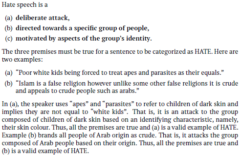

## Naive Bayes 
  Naive Bayes model was implemented with add-1 smoothing.
  
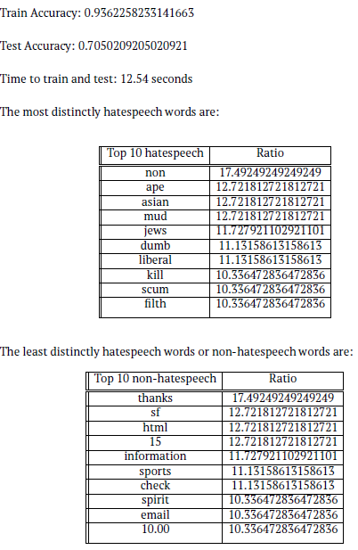
  
### Trends observed
  From the two tables above, it can be observed that the top 10 distinctly hatespeech words are words that are commonly used to describe people in a negative way. Some of these words are also directed at a person belonging to a specific race (e.g. asian), religion (e.g. jews), or a having certain political/moral leaning (e.g. liberal). The classifier is able to identify many hateful words correctly. On the other hand, the top 10 non-hatespeech words that were observed are random words like ”thanks”, ”information”, ”check”, or numbers like ”10.00” and ”15” which may not have much meaning in the context of a sentence.
    
## Logistic Regression model
   Accuracy results for LR model using unigram features:
   
   Train Accuracy: 0.9804
   Test Accuracy: 0.7285
   
   From the above data,we can observe that both the models gave almost similar performance, however logistic regression model performed slightly better with train and test data. This slightly better performance of logistic regression could be attributed to logistic regression being better at generalization, as it does not assume independence between words like Naive Bayes does.
   
##  Comparison of both models with Perceptron classifier
 * Naive Bayes and Logistic Regression models use separate training and test data. Perceptron classifier however, uses training data also as test data as this model learns online. 
 * The Perceptron classifier reads one sample instance at a time to learn about the data and update its understanding about it e.g If a prediction is incorrect, increases weights for features of the true label, and decreasesweights for features of the predicted label. On the other hand, Naive Bayes and Logistic Regression models read the entire sample dataset before updating their knowledge of the data.
 * Observations about \lambda values varying from [0.0001, 0.001, 0.01, 0.1, 1, 10]
    
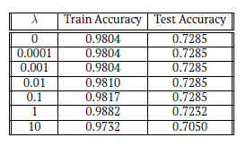

### Observations:
  From the observations of accuracy with the different \lambda values, we can see that the test accuracy remains exactly the same for \lambda values of 0, 0.0001, 0.001, 0.01 and 0.1
and starts dropping at \lambda value 1 and furthermore at value 10. On the other hand, train accuracy remains same for 0, 0.0001 and 0.001. It shows a sight increase for each \lambda value from 0.001 to 0.1 to 1, and drops again at value 10. For \lambda = 1, train accuracy increases, but test accuracy drops. This may be due to over-fitting of data.
As the train accuracy increases and test accuracy remain steady till 0.1, it can be concluded that \lambda = 0:1 value shows the highest accuracy.

# Text Prediction with Language Modeling
  This task involved implementing character level and word level n-gram language models along with a character level RNN language model.

##  Character level n-gram language model

### Part 1: Generation
    The function ngrams(n, text) produces a list of all ngrams of the specified size from the input text. Each ngram consists of a two element tuple (context, char), where the context is itself an n-length string comprised of the n characters preceding the current character. The sentence is padded with n~ characters at the beginning. If n = 0, all context is empty strings. We assume that n >= 0.
    
  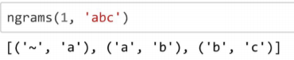
  
   The function create_ngram_model(model_class, path, n, k) creates and returns an ngram model trained on the entire input file. The n-gram model, implemented using Python standard libraries, generates random text resembling the source document. 
   * The NgramModel class constructor initializes any necessary internal variables. The function get_vocab returns the vocabulary i.e set of all characters used by the model.
    
   * The update(text) function computes the n-grams for the input sentences and updates the internal counts. the function prob(context, char) returns the probability of that character, given the preceding context. If a novel context is encountered the probability of any given char is set to 1/V where V is the size of the vocabulary.
    
   * The random_char(text) function returns a random character according to the probability distribution determined by the given context.
   
  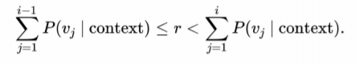
  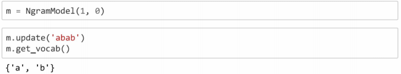
  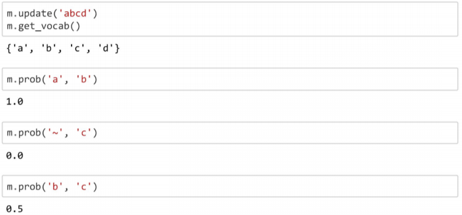
  
   * The random_text function returns a string of characters chosen at random using random_char.
   
  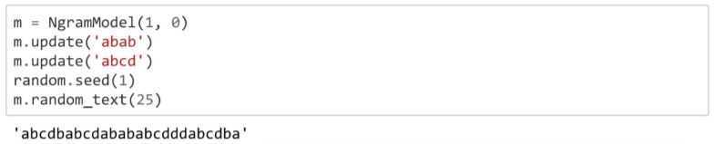
  
   *  Training the NgramModel with Shakespeare:  The implemented language model is trained on a corpus of Shakespeare. The model generates sentences from Shakespeare with different order n-gram models. 
  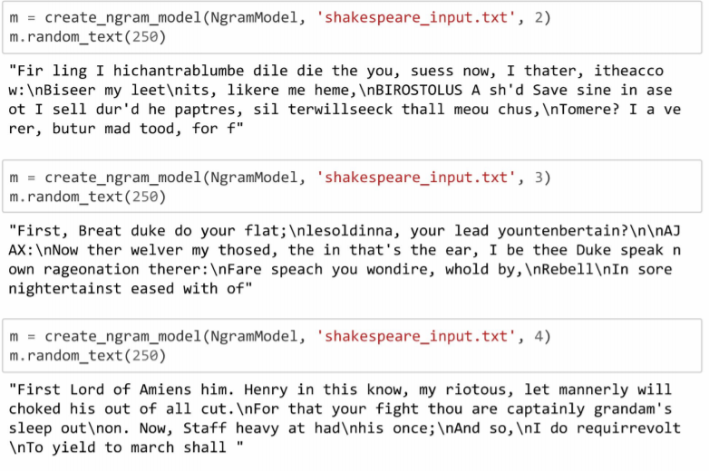
  
### Part 2: Perplexity, Smoothing and InterpolationL
  * Perplexity: To determine whether the language model is good, parlexity, the most common method for intrinsic metric of language models was implemented. The perplexity of alanguage model on a test set is the inverse probability of the test set, normalized by the number of characters.
  
  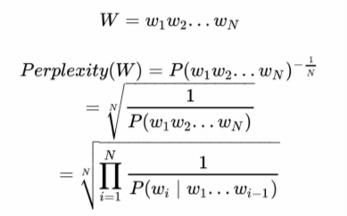
  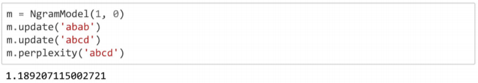
  
  * Smoothing: Laplace smoothing adds one to each count. Since there are V characters in the vocabulary and each one was incremented, the denominator is adjusted to take into account the extra V observations.
  
  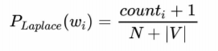
  
   A variant of Laplace smoothing was implemented which adds k to each count instead of one.
   
  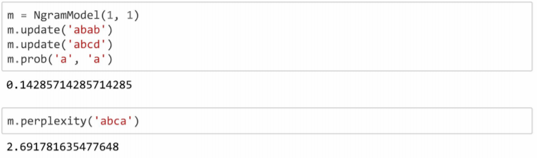
  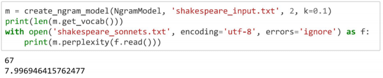
  
  * Interpolation:  Interpolation helps avoid the problem of zeros if the longer sequence is not observed in our training data. 
  
  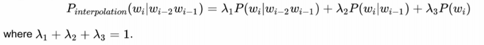
  
  The class NgramWithInterpolation extenda NgramModel to implement interpolation. Add-k smoothing takes place only when calculating individual order n-gram probabilities.
  
  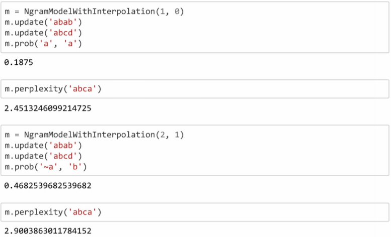
  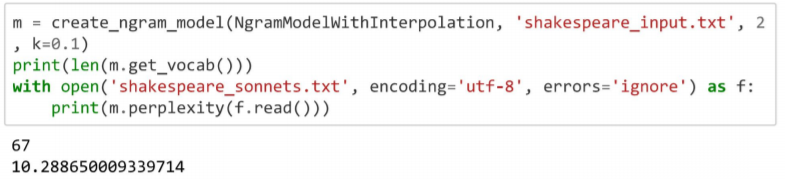
  
### Part 3: Observations:

  Observations for the ngram language models where n ≥ 1, 
  * The paragraphs which character level models generate, all start with the letter ’F’. 
  * The paragraphs which word level models generate, all start with the word ’In’.
  
  This is because, for character level models, as ’F’ is the starting letter of the input file, it is always chosen as the letter which has the highest probability of preceding other characters. As the value of n increases, the model repeated outputs ’First’ at the beginning of the paragraph. This is because, only characters that have a high probability of following the letter ’F’ are chosen as the next character. The word level model also works similarly. As ’In’ is the first word in the input file, it has the highest probability of preceding other words, which is why it is chosen repeatedly as the first word. When n = 0, all letters and words are independent of context, hence any character of letter can be chosen as the first one.

Perplexity of Shakespeare corpus for:
  (i) Character-level n-gram model: 10.2887
  (ii) Word-level n-gram model: 6095.0115
  
  From the perplexities observed for both the models, we can see that the character-leveln-gram model has a much lower perplexity than that of the word-level model.  It is evident that character level n-gram model performs better than the word leveln-gram model.However, on observing the generated text, especially those for higher order languagemodels wheren≥3, the word-level n-gram model shows a much better result. Thesentences generated by the word level model seem much more coherent than thoseof the character level n-gram model. From the sample text generated by both modelsshown below, it can  be observed that  the sentences generated  by the word-levelmodel make more sense than he character level model.Sample text generated by character-level n-gram model(n= 4): ”First Lord of Amiens him. Henry in this know, my riotous, let mannerly will chokedhis out of all cut.For that your fight thou are captainly grandam’s sleep out on. Now,Staff heavy at had his once; And so, I do requirrevolt To yield to march shall” Sample text generated by word-level n-gram model(n= 4).
  
  ”In the immediate term , though , that the negotiations with his own cabinet hadbeen rather less successful , as he has purportedly said in his letters . [E0S] They wereeventually allowed to travel outside the country and escaped .  [E0S] Neverthelessthe new form brought new questions - “ How do you create the spontaneity andchemistry  in  a  medium  that  ’s  still  evolving  .   [E0S]  New  fans  :  Lots  of  viewersexpressed their respect for George ’s attitude to life after last night ’s draw as Lottotickets sold at more than 200 a second in the hour before ticket sales close at 19:30GMT ahead of the draw at 20:30 on Wednesday”
  
 *  Character-level n-gram model: Observations with n,k and λ. The best performance was observed with n= 2, k = 0.1 and [0.9,0.05,0.05], which gives a perplexity of 7.937964955481074.
  
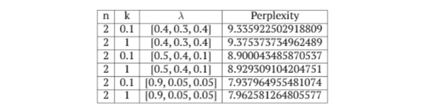
 
 *  Word-level n-gram model: Observations with n,k and λ
 
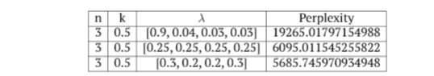
  
  The best performance was observed with n= 3, k= 0.5 and [0.3,0.2,0.2,0.3], which gives a perplexity of 5685.745970934948 Word-level n-gram model: Observations with n, k and λ.
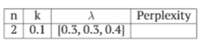
